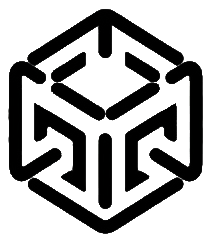
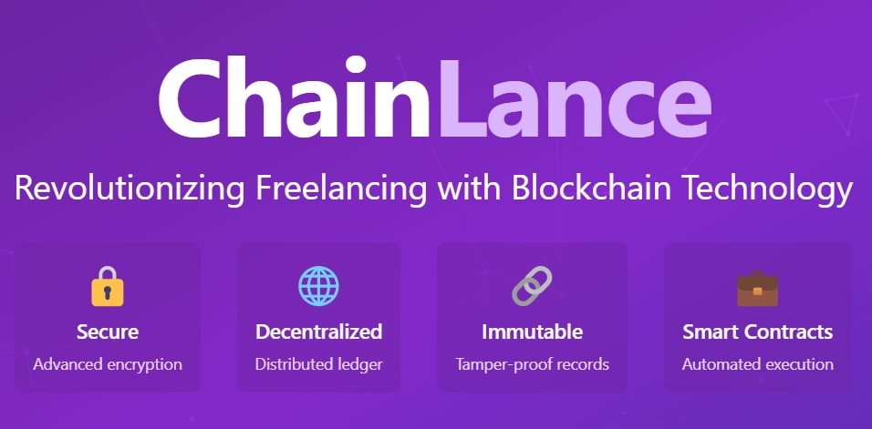

<h1><u>ChainLance</u>
  
</h1>



<p align='center'>An On-Chain Freelancing Website 🌐💼
</p>
<p align="center">
  
  
  
  
</p>

## Setup 🖥️

```
cd backend/
python3 -m pip install -r requirements.txt
python3 main.py
```

Then navigate to the frontend:

```
cd ../frontend
npm i
npm run dev
```

### MongoDB for Off-Chain Data 🔒

```
cd frontend/src/backend
nodemon server
```

## Tests ✅

- To run tests:

```
cd backend/
brownie test -sv
```

---

## What We Solve 🔐

ChainLance leverages blockchain architecture to conduct secure, end-to-end encrypted transactions. 💡 The decentralized nature of Ethereum blockchain ensures transparency and tamper-proof dealings, providing an extra layer of security. Freelancers and clients can trust that their payments and agreements are protected, reducing the risk of fraud. 💰

By using smart contracts, we ensure that both parties fulfill their obligations before transactions are completed, guaranteeing fairness and accountability. This fosters a trustworthy freelancing environment. 🤝

---

## The Problems We Faced 💭

Conducting secure transactions on the blockchain and ensuring true encryption can be challenging 🔐. This becomes even more difficult when sharing files securely, an aspect we are still working on improving. 📂

The decentralized nature of Ethereum 🪙 makes storing and sharing large files securely and efficiently a challenge. While we’ve made significant progress in securing transactions, we’re focused on enhancing our file-sharing solutions to provide a smooth and secure experience for freelancers and clients alike. 🌍

---

ChainLance is Ethereum-based 🌐, ensuring that we benefit from its decentralized, transparent, and secure ecosystem.
